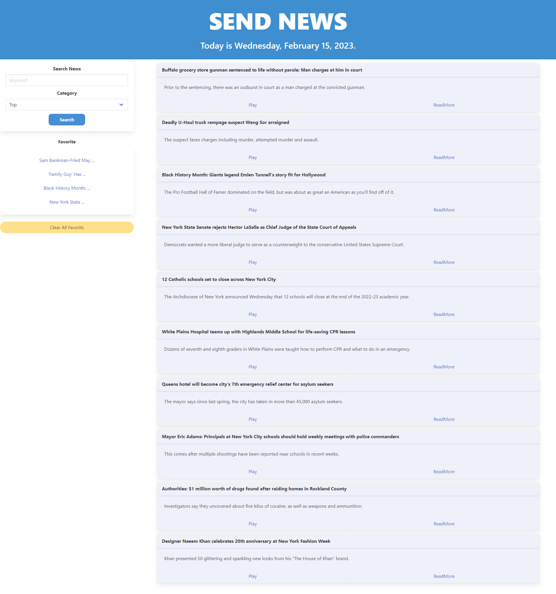
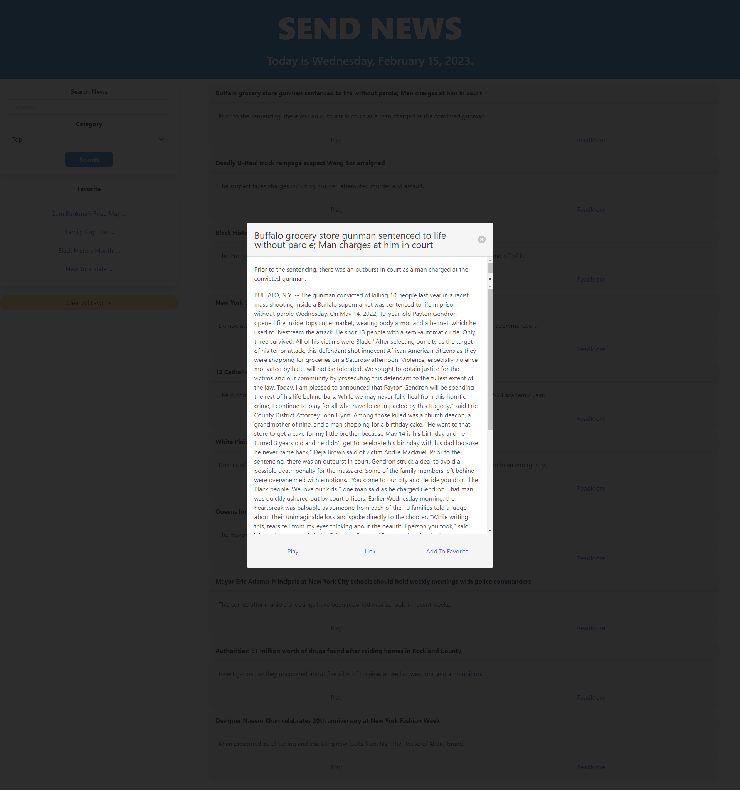
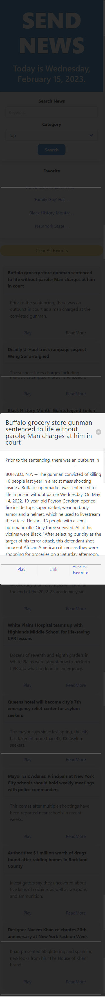

# Send News
pictures for big screens

preview pictures for mobile screens

## Description
Send News is a news article search application.  Use the search and categories form to get started. Search for the news you want.  Click "ReadMore" to open up the modal to read additonal content.  Too busy to read the news?  We got you! Click our special play feature and have the news read to you so you can go about your busy day.
## Usage:
1. Open the Send News link
2. Fill in the Search and choose the category
3. Click the ReadMore to extend the article on the modal.
4. Choose from 3 options located in our modal:

    -Play- The TTS (text-To-speach) will read the news to you.

    -Link- Takes you to the source of the article displayed.

    -Add To Favorite- Save the article you like to revisit it later on left side as link . When each saved links are clicked it will take us to sorce.   

## Collaborators:
<a href="https://github.com/Getnetgit">Getnet Ali</a> 

<a href="https://github.com/tykervella">Tyler Kervella</a> 

<a href="https://github.com/masonuw">Mason Cox</a> 

<a href="https://github.com/xKranze">Jimmy Yin</a>
## Credits:
-UW Coding Bootcamp

-https://www.voicerss.org/api/

-https://newsdata.io/documentation/

-https://bulma.io/documentation/

-https://jquery.com/